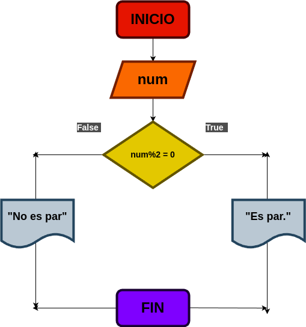

# Par_Impar

## Input

n = numero al que se desea realizar el programa

### Variables de entrada

### Prosesing

si n = n % 2 = 0  se determina par

si n = n % 2 = 1  se determina impar

### Output

respuesta

# Diseño

# Construccion